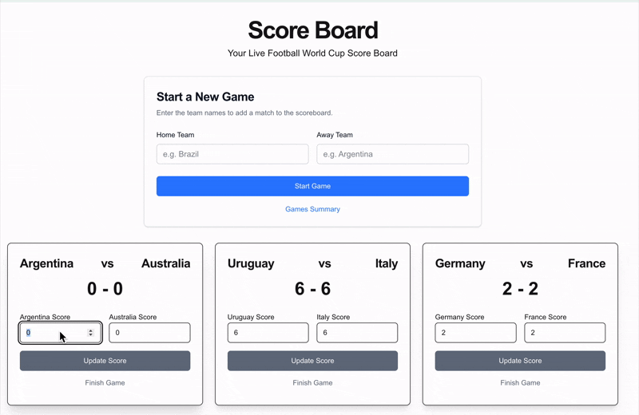

# Test Task (_Football World Cup ScoreBoard_) – Artem Astrouski

This repository contains my implementation of a test task completed on July 7, 2025. It showcases a simple, tested
library, built with Object-Oriented Design and developed using a Test-Driven Development (TDD) approach, with
progress visible in the Git history.

---

## 📝 Project Requirements

The goal was to build a simple library that contains the app’s core business logic, developed using a Test-Driven
Development (TDD) approach, with progress clearly shown in the Git history. The library supports:

1. **Start a game**
    - Create a new football match with two teams.
    - Initialize the score to 0–0.
2. **Update score**
    - Update the score for an existing game.
3. **Finish a game**
    - Remove a finished game from the scoreboard.
4. **Get a summary of games by total score**
    - Return a list of current games, sorted by:
        - Total score (highest first)
        - If equal, by most recent start time

---

## ⚙️ Implementation Details

### Library Design

- Object-Oriented Design:
    - The library uses object-oriented programming principles and implements the `ScoreBoard`, `Game`, and `Team` classes.
    - Each class follows the Single Responsibility Principle, ensuring clearly defined responsibilities.
- Data Storage:
    - Games are stored in memory with an Array List.
- Error Handling:
    - Basic validation prevents issues such as duplicate matches and invalid inputs.

### Test-Driven Development

- All features were developed using the **Test-Driven Development (TDD)** approach.
- Steps Followed:
    1. Create test cases for a piece of functionality.
    2. See the tests fail initially because the logic is not implemented yet.
    3. Develop just enough code to make the tests pass.
    4. Repeat the cycle for each new piece of functionality.

### MobX state management Integration

- MobX was chosen as a lightweight state management library because it integrates seamlessly with class
  objects and supports reactive updates out of the box.
- A manual implementation of a custom state management with an observable pattern would require additional effort and add
  complexity to the codebase.

---

## 🎥 Demo

<table>
  <tr>
    <td></td>
    <td></td>
    <td></td>
  </tr>
</table>

---

## 🛠️ Stack

- **Core**: Next.js, TypeScript
- **State Management**: MobX
- **Unit & Integration Testing**: Jest

---

## 📦 Installation

First, install the dependencies:

```bash
npm install
```

Then, run the development server:

```bash
npm run dev
```

Open [http://localhost:3000](http://localhost:3000) in your browser to see the result.
